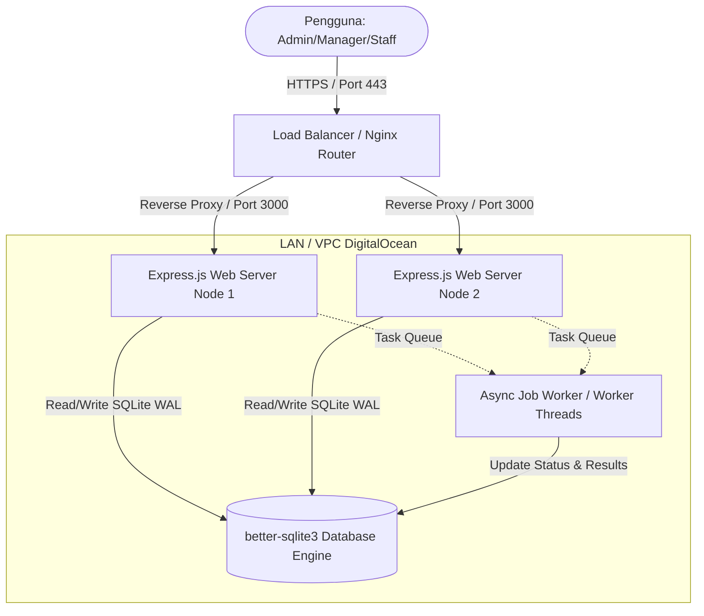

# Dokumen Arsitektur Sistem & Infrastruktur - SmartStock Pro

Dokumen ini disusun untuk menjelaskan spesifikasi perangkat keras, topologi jaringan, pemilihan pustaka (library), serta analisis skalabilitas sistem manajemen inventaris **SmartStock Pro** pada PT Maju Bersama Digital.

---

## 1. Topologi Jaringan & Server (Diagram Arsitektur)

Sistem SmartStock Pro dirancang menggunakan arsitektur modular yang memisahkan lapisan Web Server, Database, dan Worker Latar Belakang.

### Penjelasan Komponen:
1. **Nginx Load Balancer**: Berfungsi sebagai pintu gerbang utama (SSL termination, rate limiting, and traffic routing) untuk mendistribusikan beban ke beberapa instance Express server.
2. **Express.js Web Nodes**: Web server utama yang memproses request API, melayani file statis Frontend, dan memproses komputasi algoritma stok.
3. **better-sqlite3 Engine**: Penyimpanan data relasional lokal yang dioptimalkan menggunakan mode **WAL (Write-Ahead Logging)** yang memungkinkan pembacaan (Reads) paralel secara cepat dan penguncian baris penulisan (Writes) secara aman.
4. **Background Job Queue Worker**: Proses independen yang berjalan secara berulang (interval-based) untuk memproses tugas komputasi berat (generate laporan besar, import CSV bulk, sinkronisasi gudang) agar tidak memblokir respon HTTP pengguna.

---

## 2. Spesifikasi Minimum Perangkat Keras (Server Specs)

Untuk menjamin ketersediaan sistem dan respon yang cepat (<150ms), berikut adalah rekomendasi spesifikasi server:

### A. Server Web & Aplikasi (Web Node Instance)
* **Processor (CPU)**: Intel Xeon atau AMD EPYC (2 Cores, 2.4 GHz minimum)
* **RAM / Memori**: 4 GB DDR4 RAM
* **Penyimpanan (Storage)**: 20 GB SSD NVMe
* **Bandwidth Jaringan**: 1 Gbps port link, 1 TB transfer/bulan
* **Operating System**: Ubuntu Server 22.04 LTS

### B. Server Database (Jika Menggunakan Cluster Mandiri / SQLite Berbagi)
* **Processor (CPU)**: Intel Xeon (4 Cores)
* **RAM / Memori**: 8 GB RAM (Untuk caching database di memory cache index secara optimal)
* **Penyimpanan (Storage)**: 50 GB SSD NVMe (I/O tinggi untuk proses read/write berulang)

---

## 3. Analisis Skalabilitas (Scalability Analysis)

Untuk menangani lonjakan beban trafik tanpa penurunan performa sistem, taktik berikut diterapkan:
1. **SQLite WAL Mode**: Meningkatkan konkurensi penulisan dan pembacaan secara simultan. Pembacaan tidak memblokir penulisan, dan penulisan tidak memblokir pembacaan.
2. **Database Indexing**: Indeks telah dipasang pada kolom pencarian seperti `products(code)`, `users(username)`, `transactions(product_id, warehouse_id)`, serta indeks unik pada data relasi stok.
3. **Stateless Sessions**: Sesi menggunakan enkripsi cookie/cookie-session yang tersimpan aman sehingga web server dapat ditambah (Autoscaling) di belakang load balancer secara dinamis.
4. **Job Decoupling**: Pemrosesan paralel CSV dilakukan secara chunking asinkronus (Promise.all), dan komputasi laporan dilakukan oleh thread antrean belakang (`job_queue`), menghindarkan server dari penundaan timeout request.

---

## 4. Dokumentasi Library / Komponen Pihak Ketiga

Daftar dependensi yang digunakan beserta lisensi dan tujuannya:

| Library / Komponen | Versi | Lisensi | Fungsi dan Deskripsi |
| :--- | :--- | :--- | :--- |
| **Express.js** | `^5.2.1` | MIT | Framework server web inti untuk penanganan HTTP routes dan middleware. |
| **better-sqlite3** | `^12.10.0` | MIT | Driver SQLite tercepat untuk Node.js dengan dukungan query sinkronus teroptimasi. |
| **bcrypt** | `^6.0.0` | MIT | Enkripsi hashing password searah (One-way hashing) dengan salt round kuat. |
| **express-session** | `^1.19.0` | MIT | Manajemen sesi pengguna menggunakan cookie aman dan timeout otomatis. |
| **helmet** | `^8.2.0` | MIT | Pengamanan HTTP headers (XSS Filter, Clickjacking, CSP CDNs whitelist). |
| **express-rate-limit** | `^8.5.2` | MIT | Pembatas frekuensi request untuk mencegah serangan Brute Force dan DoS. |
| **multer** | `^2.1.1` | MIT | Middleware pemrosesan unggahan file multipart/form-data (gambar produk, CSV). |
| **csv-parser** | `^3.2.1` | MIT | Parser CSV asinkron berkecepatan tinggi dengan kebutuhan memori minimal. |
| **uuid** | `^14.0.0` | MIT | Generator Unique ID untuk session ID, CSRF tokens, dan token pengaman. |
| **Chart.js (CDN)** | `v4` | MIT | Render grafik interaktif (Tren, Kategori) di browser pengguna. |
| **Leaflet.js (CDN)** | `v1.9.4` | BSD-2-Clause | Integrasi peta interaktif 5 kota lokasi gudang PT Maju Bersama Digital. |
| **Lucide Icons (CDN)** | `latest` | ISC | Kumpulan ikon minimalis, modern, dan ringan untuk antarmuka dashboard. |
