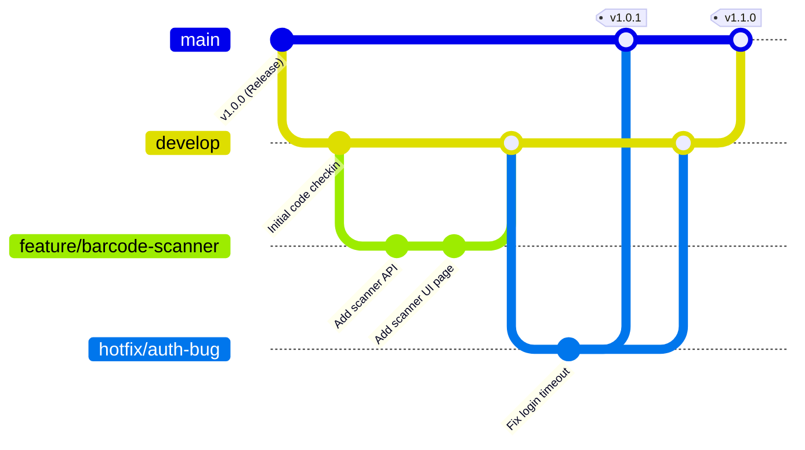

# Dokumen Strategi Migrasi Data, Cutover Plan, & Pembaharuan - SmartStock Pro

Dokumen ini menjelaskan prosedur migrasi data dari sistem spreadsheet lama ke aplikasi **SmartStock Pro**, jadwal cutover sistem, serta panduan alur pembaharuan perangkat lunak menggunakan version control (Git).

---

## 1. Strategi Migrasi Data (Spreadsheet ke SmartStock Pro)

Untuk memastikan kelancaran migrasi tanpa kehilangan data (data loss), PT Maju Bersama Digital menerapkan 4 langkah migrasi berikut:
1. **Pembersihan Data (Data Cleansing)**: Mengidentifikasi duplikasi kode barang, nilai kosong, dan memformat format harga ke angka murni dalam file spreadsheet.
2. **Ekspor CSV**: Menyimpan sheet produk dan riwayat stok ke format CSV UTF-8.
3. **Impor Batch Paralel**: Menggunakan fitur bawaan SmartStock Pro (Parallel CSV Importer) untuk memproses entri data produk dan kategori.
4. **Validasi Pasca Migrasi**: Melakukan rekap total unit barang dan nilai stok akhir antara spreadsheet vs database.

### Pemetaan Kolom Data (Field Mapping)

Berikut adalah aturan pemetaan kolom dari file Excel/Spreadsheet lama ke struktur tabel SmartStock Pro:

| Nama Kolom Excel | Kolom Target SQLite | Tipe Data | Aturan Validasi |
| :--- | :--- | :--- | :--- |
| **KODE_BARANG** | `products.code` | TEXT (Unique) | Wajib diisi, huruf kapital murni, misal: `PRD-016`. |
| **NAMA_BARANG** | `products.name` | TEXT | Wajib diisi, maks 100 karakter. |
| **KATEGORI** | `categories.code` | TEXT (FK) | Dicari di tabel kategori, dibuat otomatis jika belum ada. |
| **SUPPLIER** | `suppliers.code` | TEXT (FK) | Dicari di tabel supplier, dibuat otomatis jika belum ada. |
| **HARGA_SATUAN** | `products.price` | REAL | Nilai angka >= 0, default: 0. |
| **STOK_MINIMAL** | `products.min_stock` | INTEGER | Nilai angka >= 1, default: 10. |
| **SATUAN** | `products.unit` | TEXT | Nilai seperti `pcs`, `unit`, `box`, default: `pcs`. |
| **DESKRIPSI** | `products.description`| TEXT | Opsional. |

---

## 2. Rencana Rollback (Rollback Plan)

Jika terjadi kesalahan kritis atau kegagalan parsing di tengah proses migrasi:
* **Langkah 1**: Database SmartStock Pro diproteksi menggunakan mekanisme transaksi atomic SQLite WAL. Jika impor gagal, database otomatis membatalkan perubahan (Rollback).
* **Langkah 2**: Jika kegagalan terjadi pasca cutover, data base dibersihkan (Truncate/Delete) menggunakan database backup snapshot terakhir yang dibuat tepat sebelum cutover:
  `sqlite3 smartstock.db ".restore database_backup_prematch.db"`
* **Langkah 3**: Sistem dideklarasikan kembali ke status "Spreadsheet Mode" hingga file Excel diperbaiki oleh tim data entry.

---

## 3. Cutover Plan (Jadwal Go-Live)

Jadwal peralihan sistem dilakukan pada akhir pekan untuk menghindari gangguan operasional logistik:

### Checklist Pra-Cutover (T-3 Hari)
* [ ] Melakukan freeze entry data stok baru di spreadsheet.
* [ ] Membackup seluruh spreadsheet dari 5 gudang.
* [ ] Mengunggah berkas web server SmartStock Pro ke server produksi VPS.
* [ ] Menguji koneksi Server-Sent Events (SSE) dan load balancer.

### Langkah Cutover (Hari H - Jam 22.00 WITA)
* [ ] Menonaktifkan hak akses edit spreadsheet lama (set Read-Only).
* [ ] Mengunduh versi final spreadsheet dari 5 kota besar.
* [ ] Menjalankan script database initialization (`node database/init.js`) di server.
* [ ] Mengunggah data CSV final melalui panel admin SmartStock Pro secara paralel.
* [ ] Memverifikasi log audit keamanan: pastikan tidak ada peringatan kegagalan impor.

### Verifikasi Pasca-Cutover (Hari H - Jam 23.30 WITA)
* [ ] Memeriksa total stok per gudang di SmartStock Pro vs total spreadsheet.
* [ ] Menguji login akun multi-level (Admin, Manager, Staff, Viewer) secara live.
* [ ] Mencoba mutasi transaksi keluar/masuk 1 item dan memverifikasi notifikasi real-time.
* [ ] Mengaktifkan link domain publik `https://smartstock.majubersama.id` untuk seluruh karyawan.

---

## 4. Alur Pembaharuan Perangkat Lunak (Software Update Plan)

Untuk merilis fitur baru (seperti integrasi POS atau scanner barcode) tanpa mengganggu operasional sistem yang sedang berjalan, tim pengembang wajib mematuhi standar Version Control Git:

### Cabang (Branching) Git:
1. **`main`**: Berisi kode produksi stabil. Setiap commit harus memiliki tag versi (misal: `v1.0.0`).
2. **`develop`**: Cabang integrasi fitur baru sebelum diuji di lingkungan staging.
3. **`feature/*`**: Cabang pengembang mandiri untuk membuat fitur baru (contoh: `feature/barcode-scanner`).
4. **`hotfix/*`**: Cabang perbaikan bug mendesak yang dipotong langsung dari `main` dan segera di-merge kembali ke `main` dan `develop`.

### Analisis Dampak Perubahan (Impact Analysis)
Setiap perubahan pada modul produk wajib dianalisis dampaknya terhadap modul lain:
* **Perubahan struktur harga produk**: Berdampak pada log harga transaksi historis (`transactions`) dan evaluasi perhitungan stok FIFO/LIFO. Mitigasi: simpan harga per unit secara permanen di baris transaksi saat transaksi dibuat, bukan mengacu secara dinamis ke harga produk saat ini.
* **Perubahan ID Gudang**: Berdampak pada penghitungan kapasitas transfer dan pemetaan pin Leaflet Map. Mitigasi: tambahkan validasi foreign key constraint (`ON UPDATE CASCADE`) di database SQLite.
